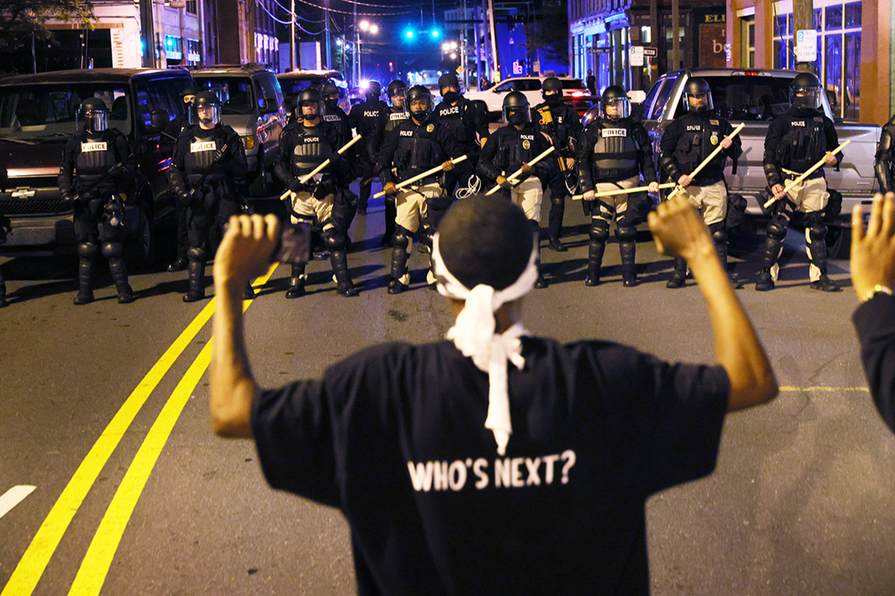

# Unpacking Police Killings in the US: A Data-Driven Look at Race and State Politics

## Introduction



The "Black Lives Matter" movement, visually underscored by images like the one above, has brought renewed attention to the issue of police violence and its disproportionate impact on minority communities in the United States. This project aims to contribute to this critical conversation by conducting a data-driven analysis of police killings. 

Our primary goal is to investigate the extent of racial disparities in police violence and explore the potential influence of state-level factors, such as political orientation, on these patterns. 

To achieve this, we will address the following key research questions:

* Is race a significant factor in police shootings?
* Does the political leaning of a state correlate with the patterns of police violence observed within its borders?
* Can we develop a model to predict racial disparities in police killings based on demographic data and political indicators?

Through this analysis, we hope to shed light on the complex interplay of race, politics, and police violence in the United States.

## Data Sources

To investigate our research questions, we draw upon a variety of publicly available datasets. These sources provide a comprehensive view of police killings, law enforcement agency characteristics, state-level political landscapes, and broader crime patterns. The primary time frame for our analysis is 2013-2020. Significant data cleaning and processing were performed to integrate these diverse sources and prepare them for analysis.

The main data sources include:

*   **Mapping Police Violence:** This dataset offers granular information on police killings, including victim demographics (race, age, gender), the circumstances surrounding the incidents, and details about the officers involved.
*   **datausa.io:** We utilize data from this source to understand the composition of police forces, specifically focusing on the gender and racial/ethnic makeup of officers.
*   **worldpopulationreview.com & Kaggle:** These sources provide state-level results for the 2016 and 2020 presidential elections, serving as an indicator of the political orientation of each state.
*   **FBI (crime-data-explorer.fr.cloud.gov & ucr.fbi.gov):** Data from the FBI's Uniform Crime Reporting (UCR) program is used to gather information on crime offenders (sex, race) and overall crime rates by state.

## Summary of Analysis and Key Findings

Our analysis primarily employed statistical modeling in R, with a focus on multilinear regression, to examine the factors influencing police killings and the racial disparities therein.

### Overall Police Killing Rates

*   A strong positive correlation was found between the rate of police killings and state-level violent crime rates.
*   A negative correlation emerged between police killing rates and the percentage of Democratic voters in a state, suggesting that states with a higher Democratic voter share tend to have lower rates of police killings.
*   Our models demonstrated a good ability to predict the overall rate of police killings based on variables such as crime rates, demographic percentages, and political leaning (explaining approximately 70% of the variance).

### Black-White Disparity in Police Killings

*   Descriptive statistics confirm that Black individuals are killed by police at a rate disproportionately higher than their representation in the general population. Between 2013 and 2020, Black individuals were killed at a rate approximately three times higher than White individuals.
*   The analysis indicated that Black individuals are more likely to be killed by police when unarmed or while fleeing, compared to White individuals.
*   Despite various model iterations, our multilinear regression models were unable to effectively predict or explain the *disparity* in killing rates between Black and White individuals using the selected variables (demographics, crime rates, political affiliation). This suggests the factors driving this disparity are complex and may not be fully captured by the variables included in our models.

### Other Observations

*   A significant gender disparity was also noted, with males constituting the vast majority (around 95%) of police killing victims.

Overall, while the analysis could model general killing rates with some success, the racial disparity in these killings remains a complex issue that our models could not fully explain with the current dataset and variables. The findings suggest that while factors like state-level crime rates and political leaning play a role in overall rates, the specific drivers of the Black-White disparity are likely more nuanced and require further investigation. For a detailed exploration of these findings, including comprehensive charts, graphs, and data visualizations, please refer to the full HTML report generated by knitting the `Report/Report.Rmd` file.

## How to Reproduce the Analysis

Follow these steps to reproduce the analysis and generate the final report:

1.  **Clone the Repository:**
    Open your terminal or command prompt and clone this GitHub repository to your local machine using the following command:
    ```bash
    git clone <repository_url> 
    ```
    (Replace `<repository_url>` with the actual URL of this repository).

2.  **Open the Project in RStudio:**
    Navigate to the cloned repository's directory. Open the project in RStudio by double-clicking the `DSFBA2021.Rproj` file. This will set the correct working directory and load project-specific settings.

3.  **Install Required R Packages:**
    The R packages necessary for this project are listed in the `Setup/set.R` file. Before proceeding, ensure these packages are installed in your R environment. You can install them by:
    *   Executing the `install.packages("package_name")` command in the RStudio console for each required package (e.g., `install.packages("dplyr")`, `install.packages("ggplot2")`, etc.).
    *   Alternatively, if the `Setup/set.R` script includes installation commands (e.g., using `pacman::p_load` or similar), you may be able to run the script directly to handle installations. Please review `Setup/set.R` for details.

4.  **Generate the Final Report:**
    Once all packages are installed, open the `Report/Report.Rmd` file in RStudio. To generate the final HTML report, click the "Knit" button in the RStudio interface. This will execute the R Markdown file, run all the analyses, and compile the report.

## Authors

This project was developed by:

*   Jérémy Olivier
*   Chloé Mousset
